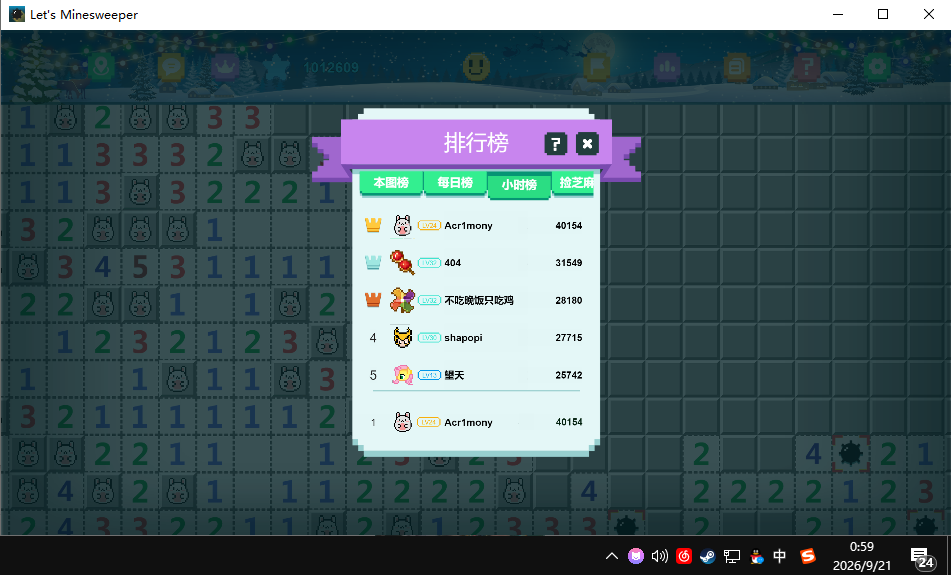

# Let's Minesweeper 自动扫雷程序

这是一个完全离线运行的 `Let's Minesweeper` 自动扫雷辅助程序。它通过读取当前游戏窗口截图，识别棋盘格、数字、地雷和特殊图形，再使用本地规则推理决定下一步操作。

程序只处理当前可见视口，不尝试读取或保存整张超大地图；当当前区域没有可执行操作时，会通过拖动鼠标探索相邻区域。

## 一、Let's Minesweeper 简单介绍

`Let's Minesweeper` 是一个经典扫雷游戏。与普通固定大小的扫雷不同，本游戏地图非常大，需要按住鼠标左键拖动视口来查看不同区域。

游戏中主要存在以下类型的格子：

- 已打开的空白格和数字格。
- 未打开的灰色格。
- 灰色背景上带有图形的已确认雷格。
- 已打开的雷图形。
- 黄色宝箱，包括打开和关闭两种外观，属于安全图形格。

## 二、特性

### 识别与推理

- 自动定位当前窗口和可见棋盘网格。
- 支持数字 `1–6` 的颜色识别。
- 灰格上出现任何图形时，按游戏规则识别为地雷。
- 支持黄色宝箱安全图形识别，并区分“打开”和“关闭”两种外观（`variant` 标记）。
- 支持“已经打开的雷”图形识别，并将其计入周围数字的雷数。
- 使用基础扫雷规则和集合差分规则推导安全格与地雷。
- 在上述规则穷尽后，对剩余约束做有界穷举推导，能识别 `1-2-1` 等重叠约束模式中的确定性雷与安全格；只输出在所有一致解中取值相同的格子，绝不输出猜测，穷举超时会安全放弃而不是硬算。
- 只执行确定性操作，不进行概率猜雷。

### 自动操作

- 连续批量右键标旗，再连续批量左键开格。
- 点击带有移动等待、按键保持和点击间隔，降低游戏漏收输入的概率。
- 自动拖动地图，拖动后等待画面稳定并重新校准网格。
- 允许从任意完整棋盘格开始拖动，拖动不会触发开格或踩雷。
- 沿未开区域边缘顺时针探索，并尽量让已开格与未开格各占视口一半。
- 单次自动运行内维护视口轨迹缓存：由每次拖动的实际像素位移推算视口位置，选择探索方向时会避开已经到过的区域，减少来回重复探索；比例救援、孤岛逃离和最后操作方向探测不受影响。
- 导航防卡死脱困：当导航拖动出现连续 `8` 次相反方向往复（如一直上下交替）或连续 `4` 次同向绕圈旋转（如上左下右循环）时，向一个随机方向连续移动 `8` 次脱困，然后继续扫雷；期间状态栏显示脱困进度。
- 当前视口清空时，先沿最后一次开格或标雷方向移动一次，再进入顺时针探索；此后持续探索，连续拖动 `5` 分钟仍未发现未开启格才结束自动运行，期间状态栏显示已探索时长。
- 识别异常时最多进行 `8` 次恢复拖动，恢复成功后继续运行。
- 踩雷后自动复活：识别到死亡对话框后，等待六秒倒计时结束，自动点击屏幕中间的绿色【复活】按钮，然后继续自动运行；复活点击不计入开格/标旗统计。
- 自动开宝箱：当前视口出现关闭的宝箱时自动点击该格，依次确认“福利宝箱”对话框的橙色【确认】和奖励对话框的绿色【确认】，然后继续扫雷；每次点击后都会验证对话框确实关闭，点空会自动重试。宝箱点击不计入开格/标旗统计，连续 3 次未能弹出对话框会自动停用该功能，避免卡在坏数据上。
- 检测到中央孤立未开区（孤岛）时直接触发脱困：向随机方向连续移动 `8` 次，然后继续扫雷，不再围绕孤岛循环。
- 沿前沿搜索超过一分钟没有找到可执行区域时，在战术台提示按 `F8` 停止并手动更换区域。

### 战术台

- 观察窗口默认不勾选“每秒自动刷新”，需要时手动开启。
- 自动运行时观察窗口保持打开。
- `F8` 启动/急停切换：观察状态下按下直接启动自动运行，运行中按下立即急停；长按只触发一次。
- 统计自动程序实际执行的累计开格和标旗数量。
- 统计数据持久化到本地，重启程序或重新开始自动运行不会清零。
- 提供“清除统计”按钮，只有手动点击后才会归零。
- 截图识别在后台线程运行，减少窗口卡顿。
- 界面为深色战术台风格，标题显示版本号，底部提供 GitHub 项目主页入口。
- 小窗口布局下，开始、暂停、执行一轮、刷新画面和自动刷新选框仍保持可见。

## 三、运行要求

### 操作系统

- Windows 10 或 Windows 11。
- 屏幕必须处于解锁状态。
- `Let's Minesweeper` 窗口需要保持可见；使用屏幕截图后备方式时不能被其他窗口遮挡。

### 单文件 exe（免装 Python）

双击 `dist\LetsMinesweeperBot.exe` 即可运行，无需安装 Python 和依赖库：

- 启动时会请求管理员权限（UAC 弹窗），这是模拟鼠标输入所必需的，请选择“是”。
- 累计统计数据保存在 exe 同目录的 `data\statistics.json`，随 exe 移动。
- 首次运行可能触发 SmartScreen 提示（程序未签名），选择“仍要运行”即可。
- 修改源码后可运行 `build_exe.cmd` 重新打包。

### 软件环境

- Python 3.10 或更高版本。
- Python 标准库中的 Tkinter。
- Pillow。
- NumPy。
- OpenCV-Python。

当前项目使用的导入依赖为：

```text
Pillow
numpy
opencv-python
```

自动点击通常需要以管理员权限运行程序；如果出现 `WinError 5`，请使用“以管理员身份运行”。

## 四、软件说明

### 文件结构

```text
lets-minesweeper-bot/
├─ app.py                         # 战术台界面和程序入口
├─ start-minesweeper-bot.cmd      # Windows 启动脚本
├─ minesweeper/
│  ├─ automation.py               # 自动扫雷、导航、对话框处理和恢复逻辑
│  ├─ capture.py                  # 游戏窗口截图
│  ├─ dialogs.py                  # 死亡/福利宝箱/奖励对话框与按钮检测
│  ├─ geometry.py                 # 棋盘网格校准
│  ├─ input_control.py            # 鼠标点击和拖动
│  ├─ observer.py                 # 观察、稳定检测和图像覆层
│  ├─ recognition.py              # 格子与特殊素材识别
│  ├─ solver.py                   # 局部扫雷约束求解
│  └─ statistics.py               # 累计统计持久化
├─ tests/                         # 离线测试
├─ samples/                       # 本地截图和识别结果样本
├─ data/statistics.json           # 累计开格/标旗数据
└─ shice.png                      # 游戏实际效果图
```

### 战术台示意

战术台左侧显示当前棋盘截图和识别覆层，右侧显示当前安全格、建议标雷、未开格、累计统计和操作按钮。

颜色含义：

- 蓝框：确定安全，可以开格。
- 红框：逻辑推导出的待标雷。
- 绿框：游戏画面中已经带图形的确认雷。
- 深红框：已经打开的雷，不会再次操作。
- 金色框：黄色宝箱安全格。
- 紫色框：无法识别的格子，程序不会根据它点击或标雷。

### 关键安全机制

- 拖动过程中不把中间截图交给识别器。
- 鼠标释放后连续确认画面稳定，才重新识别棋盘。
- 点击批次结束后等待绿色浮动加分文字消失。
- 识别矛盾或网格异常时不执行点击。
- 识别异常恢复时先静置约半秒重读当前画面（等加分字等短暂干扰自行消失），仍异常才拖动换区；连续失败后会丢弃格距缓存强制全量重新校准，避免被错误坐标系反复卡死，停机报告会注明具体矛盾格。
- 复活检测基于死亡对话框的青白色底和亮绿按钮的实心色块特征，正常棋盘不会误触发；等待期间随时可以按 `F8` 中断。
- `F8` 可以中断点击批次和拖动过程。

## 五、使用方法

### 1. 准备游戏窗口

1. 启动 `Let's Minesweeper`。
2. 将窗口还原并保持棋盘可见。
3. 如果使用自动点击，请确保游戏和自动程序使用相同的权限级别；推荐都以管理员权限运行。

### 2. 启动战术台

双击：

[start-minesweeper-bot.cmd](./start-minesweeper-bot.cmd)

也可以在项目目录运行：

```powershell
python .\app.py
```

### 3. 观察模式

程序启动后会自动读取一次当前视口。此时默认不会每秒刷新，也不会点击游戏。

需要持续观察时，勾选“每秒自动刷新”。

### 4. 执行一轮

点击“执行一轮”时，程序只处理当前画面中已经推导出的这一轮标旗和开格操作，完成后返回观察状态。

### 5. 开始自动扫雷

点击“开始自动扫雷”（或按 `F8`）后，程序会等待一秒，然后循环执行：

```text
读取当前视口
→ 批量标雷
→ 批量开格
→ 等待动画和加分文字消失
→ 重新识别
→ 必要时拖动探索
```

### 6. 暂停和紧急停止

- 点击“暂停”：等待当前鼠标按键释放后停止。
- 观察状态下按 `F8`：直接启动自动扫雷（等效点击“开始自动扫雷”）。
- 按 `F8`：立即停止后续操作；拖动过程中会释放左键。
- 如果一分钟内一直找不到可开区域，按提示使用 `F8` 停止，再手动把游戏换到新的区域。

## 六、测试过程

项目使用本地截图样本和离线单元测试验证，不需要网络。

测试覆盖内容包括：

- 普通灰格、数字、空白格识别。
- 数字 `6` 识别。
- 黄色宝箱和关闭宝箱识别。
- 已打开雷识别及雷数约束。
- `1-2-1` 模式和同尺寸重叠约束的穷举推导。
- 宽松约束下穷举不输出猜测。
- 宝箱打开/关闭外观分类。
- 死亡、福利宝箱、奖励三类对话框的检测与互不误判。
- 关闭宝箱→确认→领取奖励的完整自动流程。
- 拖动动画期间不识别，稳定后重新校准。
- 从任意格子开始拖动。
- 顺时针未开区域边缘导航。
- 开格/未开格比例救援。
- 中央未开孤岛触发脱困。
- 当前视口清空后的探索。
- 视口轨迹记录与重复区域规避。
- 导航往复振荡与绕圈旋转的检测及随机方向脱困。
- 死亡对话框与复活按钮识别，倒计时等待、自动点击与误报回归。
- 福利宝箱与奖励对话框检测、确认按钮定位与自动领取。
- 异常识别后的最多 `8` 次恢复拖动。
- 累计统计持久化和手动清零。
- 战术台默认自动刷新状态。

运行测试：

```powershell
python -m unittest discover -s .\tests -v
```

当前已验证全部 `66` 项测试通过，并完成 Python 编译检查：

```powershell
python -m compileall -q .\app.py .\minesweeper .\tests
```

## 七、效果图

以下图片为当前程序在 `Let's Minesweeper` 中运行时的实际效果截图，展示了游戏画面、棋盘格、数字、已标记雷和游戏内排行榜窗口：



图片文件位于项目同目录：

[shice.png](./shice.png)

## 注意事项

- 本程序只针对当前 `Let's Minesweeper` 的画面风格和交互方式进行识别。
- 游戏窗口移动、缩放或遮挡后，程序需要重新读取并校准。
- 遇到新图形素材时，建议先保持观察模式并采集截图，再加入识别规则。
- 程序不会获取或保存整张超大地图，只保留当前视口和少量导航状态。
